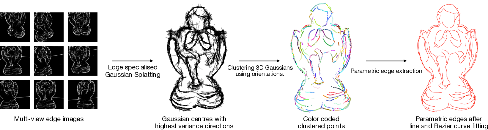

<p align="center">
  <h1 align="center">EdgeGaussians - 3D Edge Mapping using Edge-Specialized Gaussian Splatting</h1>
  <p align="center">
    <strong>Kunal Chelani</strong></a>
    ·
    <strong>Assia Benbihi</strong></a>
    ·
    <strong>Torsten Sattler</strong></a>
    ·
    <strong>Fredrik Kahl</strong></a>
  
  </p>
  <h2 align="center">WACV 2025</h2>
  <h3 align="center"><a href="https://arxiv.org/pdf/2409.12886">Paper</a></h3>
</p>

<p align="center" style="display: flex; justify-content: center;">
  
</p>

<p align="center">
EdgeGaussians applies geometrically constrained and occlusion-aware 3D Gaussian Splatting on multi-view 2D edge maps to output parametric 3D edges.  
</p>
<br>

## Install required libraries

```
git clone git@github.com:kunalchelani/EdgeGaussians.git

cd EdgeGausians

conda create --name edgegaussians --file requirements.txt

conda activate edgegaussians
```

## Datasets
For quantitiive evaluation, we use the EMAP-NEF dataset and selected scenes from the DTU dataset.
Since we use the data as formated by EMAP, you can download it using the instructions mentioned on [EMAP's repository](https://github.com/cvg/EMAP): 

Additionally, Replica dataset (as provided by EMAP with the additional colmap triangulated points) can be downloaded from [here](https://drive.google.com/drive/folders/1mERDUl-UeJzFDfjUOUHqQBuk9xVSl4PG?usp=sharing).

## Training
Assuming the data is structured as done by EMAP, you can use the following command to train EdgeGaussians on a scene:

```python train_gaussians.py --config_file <config_file_path> --scene_name <scene_name>```

For example, first set the appropriate path to data in the ```configs/ABC_DexiNed.json``` file. If you have the data copied in a directory named <i>data</i> in the root directory of this project, you can use the config as is. To then train the model on scan 00004926 from ABC-NEF dataset (as an example), run the following command:

```python train_gaussians.py --config_file configs/ABC_DexiNed.json --scene_name 00004926```


## Edge Extraction
Once the Gaussians are trained, you can extract the edges using the following command to filter the Gaussians, cluster the Gaussians into curves, and fit parametric curves through each cluster:

```python fit_edges.py --config_file <config_file_path> --scene_name <scene_name>```

Going with the above example, use the following command to additionally save filtered Gaussians and points sampled at 5mm resolution along the fit parametric curves.

```python fit_edges.py --config_file configs/ABC_DexiNed.json --scene_name 00004926 --save_filtered --save_sampled_points```

## Visualizing the results
1. The filtered Gaussians along with their major directions can be visualized using the following:

```python visualize_points_with_with_major_dirs.py --input_ply <input_ply_path>```

If the above commands have executed successfully and the output files are in a directory named <i>output</i> in the root directory of the project, running the following should open an open3d visuailzer with Gaussian means as points and lines drawn through them in the direction of their major axes:

```python visualize_points_with_major_dirs.py --input_ply output/ABC/release_DexiNed/00004926/pts_with_major_dirs.ply ```

Note that these are the Gaussians, before fitting of edges

2. The points sampled on the curves
These results are saved as regular ply files with prefex <i>edge_sampled_points</i> in the output directory of the corresponding scan.

## Evaluation - ABC-NEF

You can use the file ```eval.py``` (taken largely from EMAP) to evaluate the results. This has been verified for ABC-NEF dataset. You can use ```pre_compute_ABC_gt_sampled.py``` to precompute sampled points on the GT edges. This can also be done for individual scans with the option  ```--save_sampled_points``` when running ```fit_edges.py```.

As discussed in the paper, evaluation over the pseudo-groundtruth on the DTU dataset is not recommended. However, this can be done by changing the appropriate output paths in [EMAP's evlaution script for DTU](https://github.com/cvg/EMAP/blob/main/src/eval/eval_DTU.py).

## Notes
The evaluation numbers can have minute variation from those in the paper due to small config changes and the stochasiticity in the clustering process.


## Improvements/TODOs
1. <b>Robustness:</b> The code was developed inspired from Nerfstudio's Nerfacto, while not building upon one of the existing 3DGS pipelines, to have more control over the pipeline. In this process, several components, especially related to the adaptive control of the number and density of Gaussians, are not quite robust, especially as the scene grows larger. It would therefore be better to now use an existing Gaussian Splatting pipeline, like [3DGS-mcmc](https://github.com/ubc-vision/3dgs-mcmc) or Nerfstudio's [splatfacto](https://docs.nerf.studio/nerfology/methods/splat.html) and integrate the components into it.

2. <b>Post-processing of Edges:</b> Merging of edges, joining close to junctions - Currently, merging and joining is not performed on the resulting edges and this can easily improve the edges produced - especially for object level datasets.

3. <b>Custom dataset:</b> This can be done using the colmap data parser. This has not been tested widely. You would need to extract edges using, PidiNet for example and provide the edge image path and appropriate image resolution scaling. An example will be added soon.
    
4. Logging - Need to add better prompts for failures and outputs.


## <a name="Citing"></a>Citing EdgeGaussians

If you have found the work useful or would like to compare against it, please cite it using the following:


```BibTeX
@InProceedings{Chelani_2025_EdgeGaussians,
    author    = {Chelani, Kunal and Benbihi, Assia and Sattler, Torsten and Kahl, Fredrik},
    title     = {EdgeGaussians - 3D Edge Mapping via Gaussian Splatting},
    booktitle = {Proceedings of the Winter Conference on Applications of Computer Vision (WACV)},
    month     = {February},
    year      = {2025},
    pages     = {3268-3279}
}
```

## Contact
Please use the issues tab for any concerns. I would be happy to discuss and merge pull-requests if you notice a bug, or have any improvement ideas.

## Acknowledgement

This project uses code fragments Nerfstudio's [splatfacto](https://docs.nerf.studio/nerfology/methods/splat.html) and [EMAP](https://github.com/cvg/EMAP). We use pretrained [DexiNed](https://github.com/xavysp/DexiNed) and [PidiNet](https://github.com/hellozhuo/pidinet) for edge map extraction. We thank all the authors for their great work and repos.
